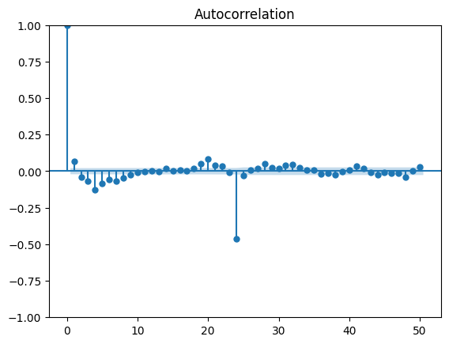
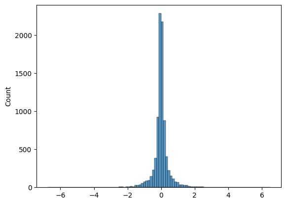

## Work in Progress

This project is actively under development as part of a larger effort to build a **robust, research-grade electricity price forecasting pipeline**, with a focus on **extreme price spike prediction**.

### Upcoming Work

- **Exogenous Features**
  - Integration of NOAA weather data (temperature, humidity, wind, etc.)
  - Study of weather-driven price dynamics

- **Deep Learning Models**
  - LSTM for nonlinear temporal dependencies
  - N-BEATSx for interpretable forecasting with exogenous variables
  - Direct comparison with statistical baselines

- **Extreme Event Modeling**
  - Quantile-based spike detection
  - Tail-aware objectives (e.g., quantile loss)
  - Improved robustness under rare events

---

# Electricity Price Forecasting (ERCOT)

This project studies **hourly electricity price forecasting in the ERCOT market**, with a particular emphasis on **rare but economically significant price spikes**.

The current implementation establishes a **strong ARIMA baseline** and a **rigorous evaluation framework**, which will later be extended to deep learning models.

> **Research Question:**  
> Can modern sequence models improve robustness and spike prediction compared to classical time series methods?

---

## Problem

Electricity prices are:

- Highly **volatile**
- Strongly **weather-dependent**
- Characterized by **heavy-tailed spikes**

While classical models perform well under normal conditions, they often fail during **extreme price events**, which are the most economically important.

---

## Dataset

- **Market:** ERCOT (Texas)
- **Target:** Houston Hub real-time price (LMP)
- **Time Range:** January 2020 – December 2023
- **Frequency:** Hourly

### Data Split

- **Train:** 2020–2021  
- **Validation:** 2022  
- **Test:** 2023
  
## Methodology

The forecasting pipeline consists of preprocessing, transformation, modeling, and evaluation steps.

### 1. Data Transformation

Electricity prices exhibit strong skewness and extreme spikes. To stabilize variance and improve model performance:

- Apply **asinh transformation**:
  - z = asinh(price)
- Apply **differencing** to remove trends and seasonality:
  - First-order differencing (lag 1)
  - Seasonal differencing (lag 24 for daily cycle)

This produces the working series: z_diff1&24

## Baseline Model

Current baseline:
- **Model:** ARIMA(0, 0, 1)
- **Target:** transformed and differenced series (`z_diff1&24`)

## Results

Performance is reported separately for normal-regime observations and spike-regime observations.

| Split | Regime | Threshold | Count | MAE | RMSE |
|------|--------|-----------|------:|----:|-----:|
| Validation | Normal | 1.2698 | 8418 | 0.2129 | 0.3259 |
| Validation | Spike | 1.2698 | 342 | 2.1738 | 2.4160 |
| Test | Normal | 1.2154 | 8244 | 0.2461 | 0.3569 |
| Test | Spike | 1.2154 | 516 | 2.2575 | 2.5963 |

## Visual Results

### Prediction vs Actual (Validation / 2022)
This plot compares the ARIMA baseline forecast against the observed transformed price series on the validation split.


### Prediction vs Actual (Test / 2023)
This plot compares the ARIMA baseline forecast against the observed transformed price series on the test split.


### Residual Analysis
Residual behavior helps diagnose whether the model is capturing the main temporal structure of the series.



### Spike Distribution
This distribution highlights the heavy-tailed nature of electricity price movements and the difficulty of forecasting extreme events.



## Key Takeaways

- The ARIMA baseline performs reasonably well in the normal regime.
- Forecasting error increases sharply during spike periods.
- Extreme price events remain much harder to predict than ordinary hourly behavior.
- This motivates adding exogenous inputs such as weather and exploring deep learning models such as LSTM or N-BEATS.

## Repository Structure

```text
electricity-price-forecasting/
├── README.md
├── data/
├── docs/
├── notebooks/
└── results/
