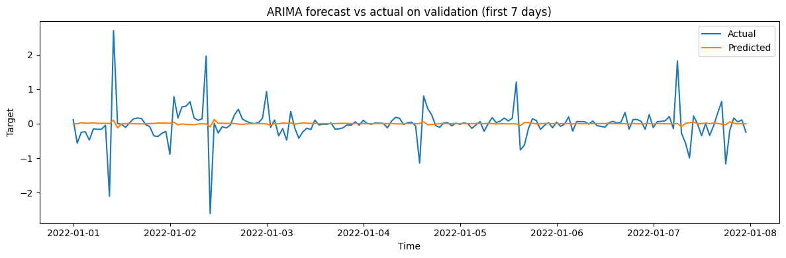
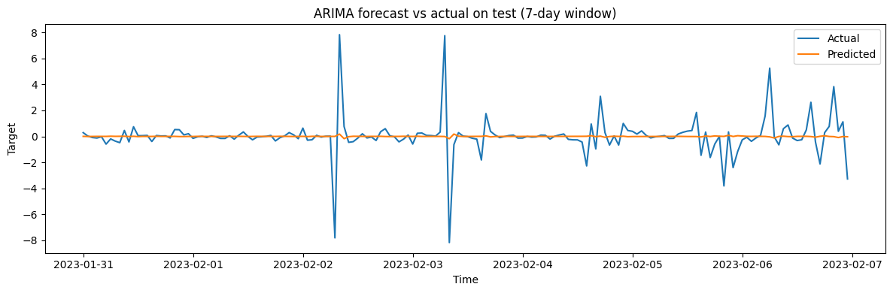

## Work in Progress

This project is an ongoing effort toward building a robust electricity price forecasting pipeline.

Upcoming work includes:
- Integrating **NOAA weather data** as exogenous inputs
- Developing **deep learning models (LSTM, N-BEATS)** for nonlinear temporal modeling
- Designing improved methods for **spike prediction and extreme event modeling**

# Electricity Price Forecasting (ERCOT)

This project studies hourly electricity price forecasting in the ERCOT market using statistical and deep learning methods. The current baseline focuses on ARIMA modeling on transformed Houston Hub real-time price data, with evaluation split between normal periods and extreme price spikes.

## Problem

Electricity prices are highly volatile and can change sharply due to demand fluctuations, weather, and grid constraints. This project explores whether classical time series methods can provide a strong baseline before moving to more advanced deep learning models.

## Dataset

- **Market:** ERCOT
- **Target series:** Houston Hub real-time hourly price
- **Time range:** January 2020 to December 2023
- **Frequency:** Hourly
- **Train / validation / test setup:** historical rolling split with separate validation and test evaluation
- **Transformations used:**
  - `asinh(price)`
  - first differencing
  - seasonal differencing at lag 24

## Baseline Model

Current baseline:
- **Model:** ARIMA(0, 0, 1)
- **Target:** transformed and differenced series (`z_diff1&24`)

## Results

Performance is reported separately for normal-regime observations and spike-regime observations.

| Split | Regime | Threshold | Count | MAE | RMSE |
|------|--------|-----------|------:|----:|-----:|
| Validation | Normal | 1.2698 | 8418 | 0.2129 | 0.3259 |
| Validation | Spike | 1.2698 | 342 | 2.1738 | 2.4160 |
| Test | Normal | 1.2154 | 8244 | 0.2461 | 0.3569 |
| Test | Spike | 1.2154 | 516 | 2.2575 | 2.5963 |

## Visual Results

### Prediction vs Actual (Validation / 2022)
This plot compares the ARIMA baseline forecast against the observed transformed price series on the validation split.



### Prediction vs Actual (Test / 2023)
This plot compares the ARIMA baseline forecast against the observed transformed price series on the test split.



### Residual Analysis
Residual behavior helps diagnose whether the model is capturing the main temporal structure of the series.


### Spike Distribution
This distribution highlights the heavy-tailed nature of electricity price movements and the difficulty of forecasting extreme events.


## Key Takeaways

- The ARIMA baseline performs reasonably well in the normal regime.
- Forecasting error increases sharply during spike periods.
- Extreme price events remain much harder to predict than ordinary hourly behavior.
- This motivates adding exogenous inputs such as weather and exploring deep learning models such as LSTM or N-BEATS.

## Repository Structure

```text
electricity-price-forecasting/
├── README.md
├── data/
├── docs/
├── notebooks/
└── results/
